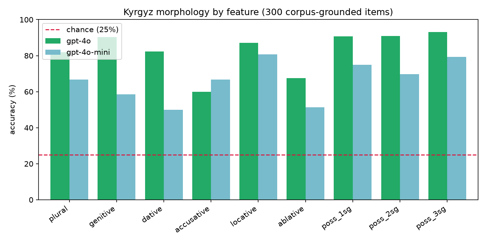
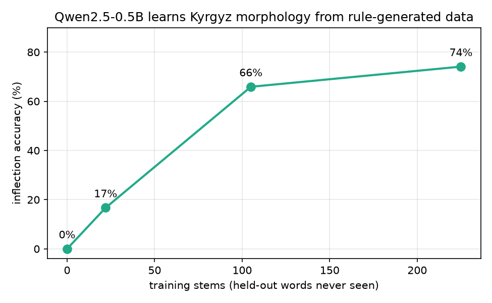
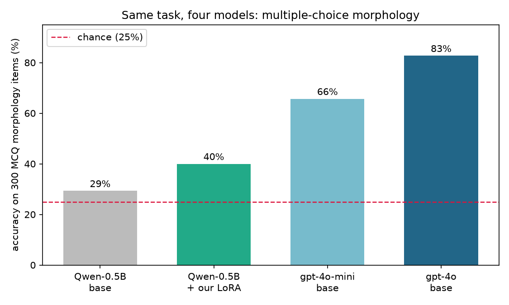

# kyrgyz-llm-benchmark

A small benchmark for how well LLMs handle Kyrgyz.

## Abstract

Kyrgyz has ~5M speakers and barely shows up in LLM evaluation. Most "multilingual" numbers for low-resource Turkic languages come from machine-translated test sets, which test the translator as much as the model. Here every question is written by hand by a native speaker and targets a specific thing a model tends to get wrong: vowel harmony, suffix stacking, idioms, spelling of ң/ө/ү, and cultural knowledge.

## Methodology

Questions are 4-option multiple choice in Kyrgyz; the model replies with one digit. Digits instead of A/B/C/D avoid Latin/Cyrillic lookalike issues. If a reply parses to neither a digit nor an exact option, it counts as wrong but is tracked as `unparseable` separately. Random guessing gets 25%, and scores are checked against that baseline with a one-sided binomial test. The validator enforces 4 distinct options and a valid key, and flags if correct answers cluster in one position; in this set the answer is spread exactly 25% per slot.

## Empirical Results & Key Findings

64 questions, 8 categories, run on two OpenAI models.

| model | score | vs. chance |
|---|---|---|
| gpt-4o | 59/64 (92%) | p ≈ 6e-30 |
| gpt-4o-mini | 55/64 (86%) | p ≈ 2e-24 |


Both models are strong overall. The interesting part is the split:

- Facts are easy. Idioms, vocabulary, translation, culture: ~100%.
- Grammar is hard. Morphology drops to **62%** (same for both models), vowel harmony to **75%**.

Two questions both models got wrong show it best. For `дос` + plural + possessive both answered `достарым`; the correct form is `досторум` (the rounded vowel forces rounded suffixes down the whole word). For the accusative of `китеп` both missed `китепти`. These are first-year grammar rules, not trivia.

So a single "90% on Kyrgyz" number hides the real gap: the model knows things about Kyrgyz but can't reliably inflect a noun. You only see it if you test morphology on its own.

### At scale

The morphology finding above rests on a handful of hand-written items. To put weight behind it, the same models were run on 300 corpus-grounded inflection items (see [Two benchmarks](#two-benchmarks)):

| model | morphology accuracy | 95% CI |
|---|---|---|
| gpt-4o | 248/300 (82.7%) | 78–87% |
| gpt-4o-mini | 197/300 (65.7%) | 60–71% |



The weakness holds up over hundreds of items, and the per-case breakdown is itself informative. Both models are weakest on the cases whose suffix both harmonises and assimilates to the stem: the ablative and the accusative sit near 60% even for gpt-4o, while the possessives, whose suffix is more regular, reach the low 90s. The smaller model is worse almost everywhere but not uniformly: the gap between the two is widest exactly on the cases that need the most phonological computation (dative, genitive), which is where model scale appears to buy the most.

## Categories

| category | tests |
|---|---|
| `vowel_harmony` | picking the suffix the vowels require |
| `morphology` | stacking case / possessive / number |
| `syntax` | which sentence is well-formed |
| `lexical_semantics` | word meaning, synonyms |
| `idioms` | fixed expressions, non-literal meaning |
| `culture` | Manas, traditions, history, geography |
| `translation` | meaning across ky/ru/en |
| `orthography` | ң, ө, ү and easy-to-miss spellings |

## Two benchmarks

`data/items.json` is the **core** benchmark: 64 questions written and verified by a native speaker, spanning all eight categories. This is what the results above use.

`data/items_generated.json` is a larger **morphology-only** set built by `build_generated_benchmark.py`. Its stems are real nouns attested in the corpus (see below) and its answers come from the verified rule engine, so it is reliable, but it covers only inflection, not idioms or culture, which cannot be generated automatically. It exists to test the paper's central finding at scale: the morphological weakness shows up on a handful of hand-written items, and this set lets it be measured over hundreds. It is kept separate and never presented as native-authored.

```bash
python build_generated_benchmark.py --limit 300
python validate_items.py data/items_generated.json
python run_benchmark.py --provider openai --model gpt-4o --items data/items_generated.json
```

## Morphology generator

Since morphology is where models fail, `morphology.py` encodes Kyrgyz noun inflection as rules: vowel harmony (4-way), consonant assimilation, and final-obstruent voicing. Given a list of stems it produces plural, five cases, and three possessives, plus multiple-choice items whose wrong options are real harmony violations. Its rules are unit-tested against the hand-verified forms in the benchmark.

```bash
python generate_morphology.py --sample 30      # print forms to eyeball
python generate_morphology.py                  # write training pairs + MCQ items
```

Stems are drawn from three independent resources and a stem is kept only if at least two of them attest it:

| source | contributes |
|---|---|
| [apertium-kir](https://github.com/apertium/apertium-kir) (GPL) | lexicographic coverage, glosses |
| [UD Kyrgyz treebanks](https://github.com/UniversalDependencies/UD_Kyrgyz-KTMU) (KTMU, TueCL) | corpus attestation and frequency |
| Wiktionary via [kaikki.org](https://kaikki.org/dictionary/Kyrgyz/) | definitions |

Requiring two sources removes typos and one-off dictionary artefacts, and the treebank frequency gives a principled ranking: the selected stems are the common words of the language rather than an arbitrary sample.

`extract_stems.py` then filters for what actually teaches native morphology. It drops entries the Apertium maintainers flagged as uncertain, and screens borrowings four ways: letters that occur only in Russian loans (в, ф, ц, щ, ь, ъ, ё), initial consonant clusters, international suffixes, and stems whose vowels are not internally harmonic. That last test is principled rather than ad hoc: a native Kyrgyz root keeps all its vowels in one backness class, so `коридор` and `музей` fail it while `карышкыр` and `күмүш` pass. A further check catches lemmas that are already plural: if stripping a plural suffix leaves another attested noun, as in `жолдор` and `үйлөр`, the entry is dropped so the generator never inflects an inflected form. What survives is balanced across all sixteen combinations of harmony class and final-segment type.

```bash
git clone https://github.com/apertium/apertium-kir /tmp/apertium-kir
git clone https://github.com/UniversalDependencies/UD_Kyrgyz-KTMU /tmp/UD_Kyrgyz-KTMU
curl -o /tmp/kyrgyz_wikt.jsonl https://kaikki.org/dictionary/Kyrgyz/kaikki.org-dictionary-Kyrgyz.jsonl

python extract_stems.py --apertium /tmp/apertium-kir/apertium-kir.kir.lexc \
  --ud /tmp --wiktionary /tmp/kyrgyz_wikt.jsonl
python stem_coverage.py data/stems_multi.txt
```

Apertium's own two-level rules were also used to check the engine. Its `N Desonorisation` rule confirmed that the genitive and accusative onset is `д` rather than `н` after stems ending in `й`, `л`, `з`, `р`, which corrected a bug the fine-tuned model had been flagging by disagreeing with the gold forms.

This turns a small verified stem list into thousands of items, for expanding the test set and for fine-tuning experiments. A native speaker still checks the stem list and a sample of the output; the rounding-harmony edge cases are the ones to watch.

`finetune_qlora.ipynb` uses the generator to teach an open model this morphology: it holds out a fifth of the stems, trains a QLoRA adapter on the rest, and scores the model on the held-out words before and after. Runs on a free Kaggle GPU.

The same experiment runs locally on Apple Silicon with MLX, no cloud account needed:

```bash
python export_mlx_data.py
python -m mlx_lm lora --model mlx-community/Qwen2.5-0.5B-Instruct-4bit \
  --train --data mlx_data --iters 400 --batch-size 4 --num-layers 8 \
  --mask-prompt --adapter-path adapters
python eval_local.py                      # base
python eval_local.py --adapter adapters   # fine-tuned
```

The base model does not inflect at all: asked for the plural of `тургун` it answers `турум`. After training on rule-generated forms it reaches **77%** on words it never saw.



| training stems | held-out accuracy | test items |
|---|---|---|
| 0 (base model) | 0.0% | 531 |
| 22 | 16.7% | 54 |
| 105 | 65.9% | 270 |
| 208 (cross-attested) | **77.0%** | 531 |

Each run holds out a fifth of the stems, so accuracy is measured only on words absent from training; the gain is generalisation of the rules, not memorised forms. Test sets differ in size between runs because they are drawn from the stem list being used. Training takes about 20 minutes on an M1 Air at 1.1 GB peak memory.

The remaining errors concentrate on the two rules that interact with the stem's final consonant: intervocalic voicing and devoicing after a voiceless stop.

### Generation and recognition are not the same task

The 0% to 77% figures above are a **generation** task: the model writes the inflected form and it must match exactly. That is harder than the four-option benchmark the GPT models took, where a lucky guess scores 25%. To compare all four models fairly, the two Qwen models were also run on the same 300 multiple-choice items:



| model | MCQ accuracy |
|---|---|
| gpt-4o | 82.7% |
| gpt-4o-mini | 65.7% |
| Qwen-0.5B + our LoRA | 40.0% |
| Qwen-0.5B base | 29.3% |

On equal footing the fine-tuned 0.5B model does **not** overtake the frontier models: it moves from just above chance (29%) to 40%, while gpt-4o-mini and gpt-4o are far ahead. The lesson is that the two tasks measure different things. Fine-tuning on rule data genuinely teaches the model to *produce* inflected forms (the 77% generation result), but multiple choice also demands parsing a Kyrgyz question and weighing four distractors, which stretches the language understanding a 0.5B model does not have. A larger base model would be the fair target for the fine-tuning intervention, and is the obvious next experiment.

## Files

```
data/items.json         the benchmark
data/stems.example.txt  stem list for the generator
src/kyrgyz_eval/         loading, prompting, scoring, stats, morphology
validate_items.py       check the item file
run_benchmark.py        items -> model -> results/*.csv
analyze.py              results -> summary.json + charts
generate_morphology.py  stems -> training pairs + generated items
```

## Run

```bash
python3 -m venv .venv && source .venv/bin/activate
pip install -r requirements.txt
export OPENAI_API_KEY=...

python run_benchmark.py --provider openai --model gpt-4o
python analyze.py results/gpt-4o.csv
```

Adding questions: see [AUTHORING.md](AUTHORING.md). Tests: `pytest`.

## License

MIT
