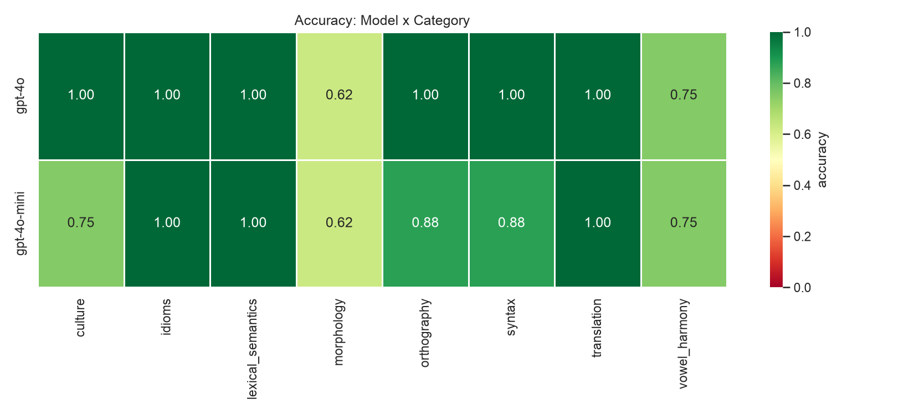

# kyrgyz-llm-benchmark

A small benchmark for how well LLMs handle Kyrgyz.

## Abstract

Kyrgyz has ~5M speakers and barely shows up in LLM evaluation. Most "multilingual" numbers for low-resource Turkic languages come from machine-translated test sets, which test the translator as much as the model. Here every question is written by hand by a native speaker and targets a specific thing a model tends to get wrong: vowel harmony, suffix stacking, idioms, spelling of ң/ө/ү, and cultural knowledge.

## Methodology

Questions are 4-option multiple choice in Kyrgyz; the model replies with one digit. Digits instead of A/B/C/D avoid Latin/Cyrillic lookalike issues. If a reply parses to neither a digit nor an exact option, it counts as wrong but is tracked as `unparseable` separately. Random guessing gets 25%, and scores are checked against that baseline with a one-sided binomial test. The validator enforces 4 distinct options and a valid key, and flags if correct answers cluster in one position; in this set the answer is spread exactly 25% per slot.

## Empirical Results & Key Findings

64 questions, 8 categories, run on two OpenAI models.

| model | score | vs. chance |
|---|---|---|
| gpt-4o | 59/64 (92%) | p ≈ 6e-30 |
| gpt-4o-mini | 55/64 (86%) | p ≈ 2e-24 |



Both models are strong overall. The interesting part is the split:

- Facts are easy. Idioms, vocabulary, translation, culture: ~100%.
- Grammar is hard. Morphology drops to **62%** (same for both models), vowel harmony to **75%**.

Two questions both models got wrong show it best. For `дос` + plural + possessive both answered `достарым`; the correct form is `досторум` (the rounded vowel forces rounded suffixes down the whole word). For the accusative of `китеп` both missed `китепти`. These are first-year grammar rules, not trivia.

So a single "90% on Kyrgyz" number hides the real gap: the model knows things about Kyrgyz but can't reliably inflect a noun. You only see it if you test morphology on its own.

## Categories

| category | tests |
|---|---|
| `vowel_harmony` | picking the suffix the vowels require |
| `morphology` | stacking case / possessive / number |
| `syntax` | which sentence is well-formed |
| `lexical_semantics` | word meaning, synonyms |
| `idioms` | fixed expressions, non-literal meaning |
| `culture` | Manas, traditions, history, geography |
| `translation` | meaning across ky/ru/en |
| `orthography` | ң, ө, ү and easy-to-miss spellings |

## Files

```
data/items.json         the benchmark
src/kyrgyz_eval/         loading, prompting, scoring, stats
validate_items.py       check the item file
run_benchmark.py        items -> model -> results/*.csv
analyze.py              results -> summary.json + charts
```

## Run

```bash
python3 -m venv .venv && source .venv/bin/activate
pip install -r requirements.txt
export OPENAI_API_KEY=...

python run_benchmark.py --provider openai --model gpt-4o
python analyze.py results/gpt-4o.csv
```

Adding questions: see [AUTHORING.md](AUTHORING.md). Tests: `pytest`.

## License

MIT
